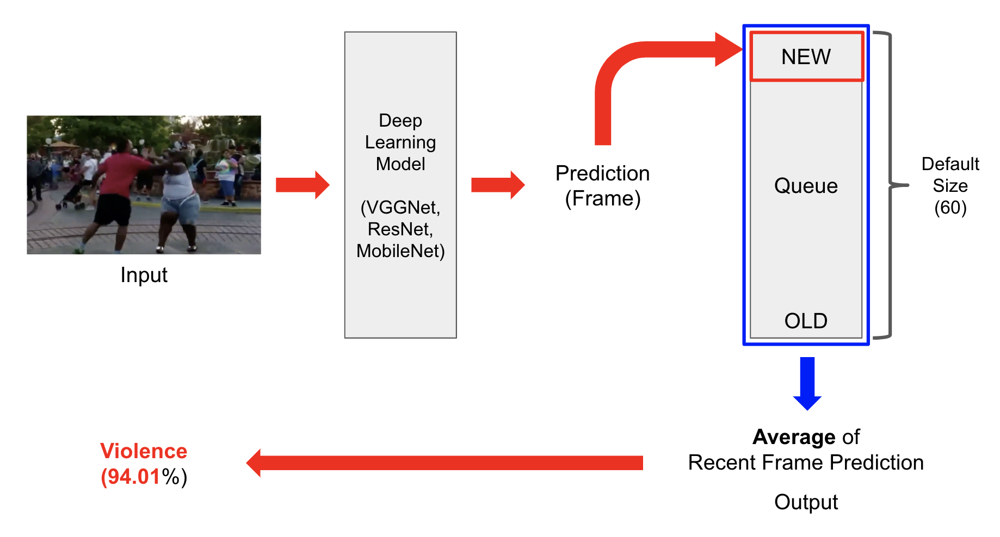

# VIOLENCE SITUATION CLASSIFICATION

## DATA COLLECTION
사용한 데이터는 `Kaggle`에서 제공하는 데이터를 사용했다. 해당 데이터를 크게 `Violence`와 `NonViolence`로 각각 1000개의 영상에 대해서 나뉘어져있다. 

> [Real Life Violence Situations Dataset](https://www.kaggle.com/mohamedmustafa/real-life-violence-situations-dataset)

## DATA PREPROCESS

## MODEL
 `Keras`에서 제공하는 [pretrained model](https://keras.io/applications/)은 아래와 같다. 그 중 우리가 사용한 모델은 볼드체로 표시해두었다.
- Xception
- **VGG16**
- VGG19
- **ResNet, ResNetV2**
- InceptionV3
- InceptionResNetV2
- **MobileNet / MobileNetV2**
- DenseNet
- NASNet

## STRUCTURE


## TRAIN CODE
아래의 명령어를 통해서 학습을 진행할 수 있다. `dataset`에는 학습하고자 하는 데이터셋의 위치를 의미한다. `model`은 학습된 모델을 저장할 경로를 의미한다. 또한 `label-bin`은 학습된 모델이 가지고 있는 클래스를 따로 저장하게 했다. `epochs`는 학습한 에폭의 수를 의미한다.
```shell
python train.py --dataset data \
                --model model/violence_resnet50.h5 \
                --label-bin model/lb.pickle  \
                --epochs 10
```

---

## INFER CODE
아래의 명령어를 통해서 추론을 진행할 수 있다. `model`,`label-bin`은 학습을 진행하는 명령어와 동일하므로 생략한다. `input`은 추론하고자 하는 사진이나 영상의 위치를 의미한다. `output`은 입력을 통해서 들어온 영상를 처리 후 저장하는 경로를 의미한다. 마지막으로 `size`는 큐 사이즈를 의미한다.
```shell
python predict_video.py --model model/violence_resnet50.h5 \
                        --label-bin model/lb.pickle \
                        --input example_clips/lifting.mp4 \
                        --output output/lifting_128avg.avi \
                        --size 64
```

실시간으로 추론을 하고 싶다면 아래의 코드를 통해서 진행할 수 있다.`input`에 `camera`라고 입력하면 된다.
```shell
python predict_video.py --model model/violence_resnet50.h5 \
                        --label-bin model/lb.pickle \
                        --input camera \
                        --output real_time.avi \
                        --size 64
```

## REFERENCE
- https://www.pyimagesearch.com/2019/07/15/video-classification-with-keras-and-deep-learning/
- https://www.pyimagesearch.com/2019/05/20/transfer-learning-with-keras-and-deep-learning/
